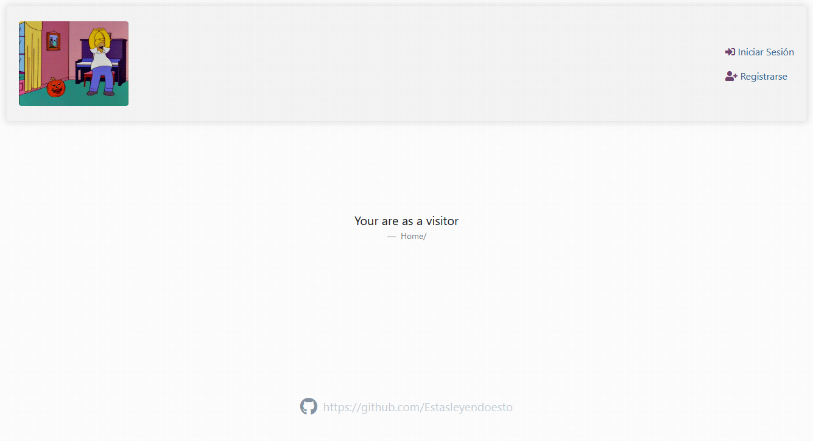

# Django user.auth

> Creado el 01-05-2021


Extendiendo el modelo `User` con `AbstractUser` para añadir campos adicionales o modificar los ya existentes. Incluye un sistema de autenticación personalizado usando el propio que trae Django por defecto además de nuevas funcionalidades. Este es un proyecto base del que se puede partir para ahorrarse programar la autenticación de usuarios en gran medida.


## Instalación

```bash
mkdir user.auth
```

```bash
git clone https://github.com/Estasleyendoesto/django.auth.git .
```

 ```bash
rm -rf .git
 ```

```bash
python -m venv venv
```

 ```bash
 venv\scripts\activate
 ```

```bash
pip install -r requirements.txt
```

 ```bash
cd mysite
 ```

```bash
py manage.py runserver
```


## Funcionalidades

- Posibilidad de añadir campos al modelo `User`
- Login mediante nombre de usuario o email
- Registro con verificación de cuenta mediante un token por email con temporizador
- Logout con redirección a otra vista
- Acceso al perfil del usuario mediante el nombre de usuario y `get_absolute_url()`
- Configuración de la cuenta
- Cambio de contraseña confirmando con la contraseña anterior
- Reestablecer la contraseña en caso de olvido mediante un token por email y con temporizador
- Eliminar cuenta (desactivar) `No implementado, pero es con user.is_active = False`
- Restricción de acceso a ciertas vistas, ej. la vista registro si el usuario ha iniciado sesión
- Error 404 si se introduce el perfil de un usuario que no existe (posibilidad de redirección)
- Uso de Google reCaptcha y captchas nativos para Django
- Urls personalizables


## Cómo integrarlo a mi proyecto
No puede integrarse en un proyecto ya creado porque estamos usando `AbstractUser`, aconsejo copiar el repositorio siguiendo la instalación y trabajar a partir de allí usándolo como base. Si tienes tus propias preferencias en organizar tu proyecto puedes usar las instrucciones para intentar adaptarlo e integrarlo, quizás te encuentres con errores al importar los módulos pero nada que no pueda solucionarse fácilmente. Recuerda que debes reemplazar el modelo `User` que trae Django por defecto con `AbstracUser`, puedes hacerlo siguiendo la [documentación oficial](https://docs.djangoproject.com/en/3.2/topics/auth/customizing/#substituting-a-custom-user-model)

No he creado una aplicación directa para instalar con pip porque no se podría personalizar en su totalidad. En su lugar prefiero optar por integrarlo manualmente en mi proyecto y así tener un mayor nivel de personalización.


#### Instrucciones

1. Instalar [Pillow](https://pypi.org/project/Pillow/) y [Django Simple Captcha](https://pypi.org/project/django-simple-captcha/) 

1. Copiar el directorio `users/` dentro de `apps/` en nuestro proyecto

2. Comprobar dentro de `users/apps.py`...

   ```python
   from django.apps import AppConfig
   
   class UsersConfig(AppConfig):
       default_auto_field = 'django.db.models.BigAutoField'
       
       # Si nuestras aplicaciones están dentro del directorio apps
       name = 'apps.users'
       # Si están en la raíz
       name = 'users'
   
   ```

3. Registrar dentro de `settings.py`

   ```python
   TEMPLATES = [
   	{
   		'DIRS': [ BASE_DIR / 'templates' ],
   	}
   ]
   
   STATICFILES_DIRS = [
       BASE_DIR / "static"
   ]
   
   INSTALLED_APPS += [
   	'apps.users',
       'captcha',
   ]
   
   # 'apps.' si las aplicaciones están dentro del directorio apps/, sino eliminar 'apps.'
   AUTHENTICATION_BACKENDS = ['apps.users.backends.UsernameEmailBackend']
   AUTH_USER_MODEL = 'users.User'
   EMAIL_VERIFY_TIMEOUT = 60 # In seconds
   PASSWORD_RESET_TIMEOUT = 60 * 60 # In seconds
   
   # Envío de email por consola (eliminar en producción)
   EMAIL_BACKEND = 'django.core.mail.backends.console.EmailBackend'
   ```

4. Registrarlo en `urls.py`

   ```python
   urlpatterns = [
       #...
   	path('member/', include('apps.users.urls')),
   	path('captcha/', include('captcha.urls')),
   ]
   ```

5. Copiar el directorio `templates/` a la raíz

6. Copiar el directorio `static/` a la raíz

7. Instalar

   ```bash
   py manage.py makemigrations
   py manage.py migrate
   ```

8. ```bash
   py manage.py runserver
   ```


## Librerías necesarias

#### Pillow

```
https://pypi.org/project/Pillow/
```


#### Django Simple Captcha

```
https://pypi.org/project/django-simple-captcha/
```


### Google reCaptcha

```
https://www.google.com/recaptcha/admin/create
https://developers.google.com/recaptcha/docs/v3
```


## A tener en cuenta

El fichero `users/sender.py` dentro de la función `send_email(...)` podrías tener la necesidad de cambiar el sujeto del email `subject...` o la ruta del template del email `message...`

Si no implementas `EMAIL_VERIFY_TIMEOUT` dentro de `settings.py` podrías obtener un error.

Si tus aplicaciones están dentro de un directorio `apps/` dentro del fichero `users/apps.py` debes modificar `name=apps.user`. De tenerlo en la raíz debería ser `name=user`

Si tu proyecto aún no tiene una vista `home` puedes apañártelas con esto:

```python
# mysite/urls.py
from django.views.generic import TemplateView

urlpatterns += [
	path('', TemplateView.as_view(template_name="home.html"), name='home'),
]
```

No olvides habilitar el uso de ficheros estáticos en la fase de desarrollo si no se muestran correctamente:

```python
# mysite/urls.py

from django.conf import settings
from django.conf.urls.static import static

if settings.DEBUG:
    urlpatterns += static(settings.STATIC_URL, document_root=settings.STATIC_ROOT)
    urlpatterns += static(settings.MEDIA_URL, document_root=settings.MEDIA_ROOT) # If media/ exists
```

El uso de Google reCaptcha existe un ejemplo dentro del template `login.html`, sino sigue la documentación.

Los captchas para Django son altamente personalizables, verificar desde la documentación oficial.
